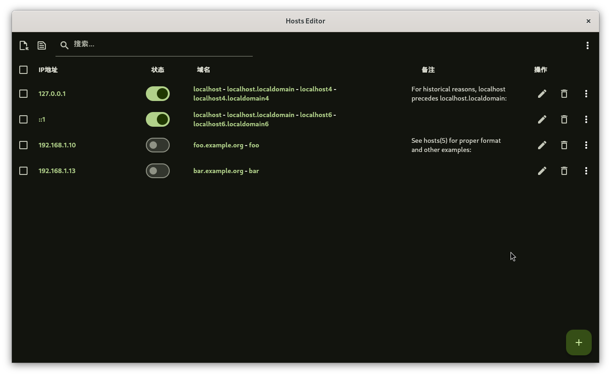
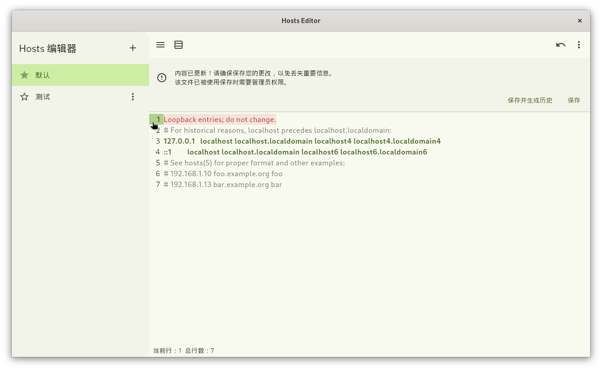

# Hosts Editor

Hosts Editor 是一个使用 Flutter 开发的应用程序，旨在简化 Linux、MacOS、Windows 系统上 hosts 文件的编辑和管理。该工具提供了一个用户友好的界面，使用户能够轻松地添加、修改和删除 hosts 文件中的条目。

## 特性

- **跨平台支持**：虽然目前只支持 Linux 系统，但未来计划扩展到其他操作系统。
- **直观的用户界面**：使用 Flutter 构建，提供流畅的用户体验。
- **实时预览**：在编辑 hosts 文件时，实时查看更改效果。
- **安全性**：确保对 hosts 文件的修改是安全的，避免不必要的错误。

## 页面

